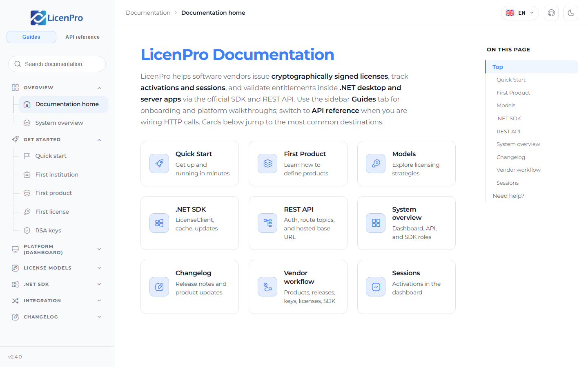
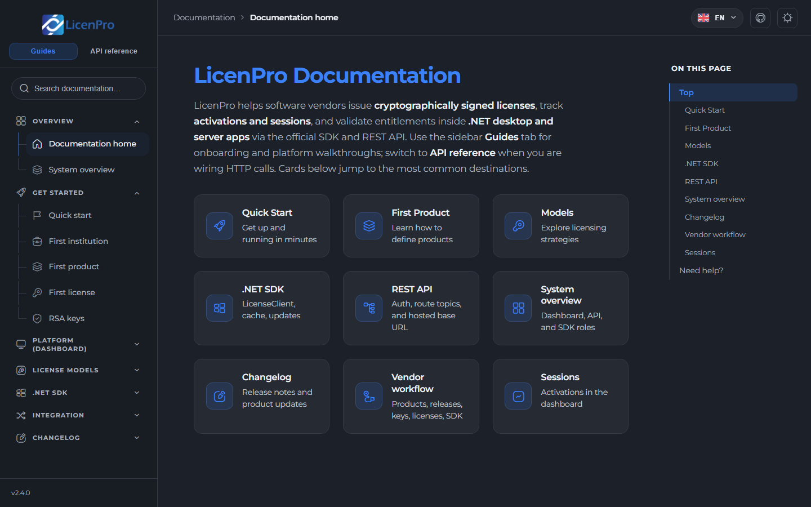
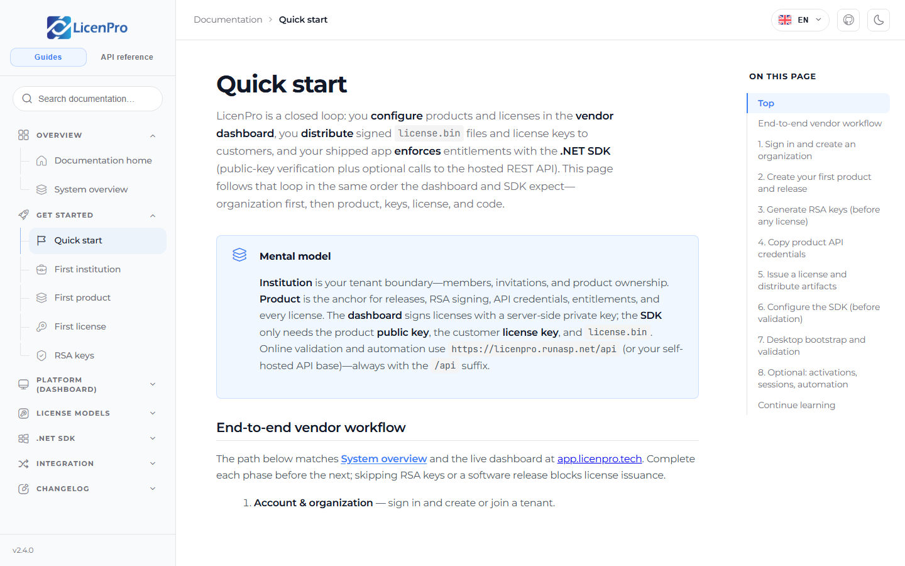
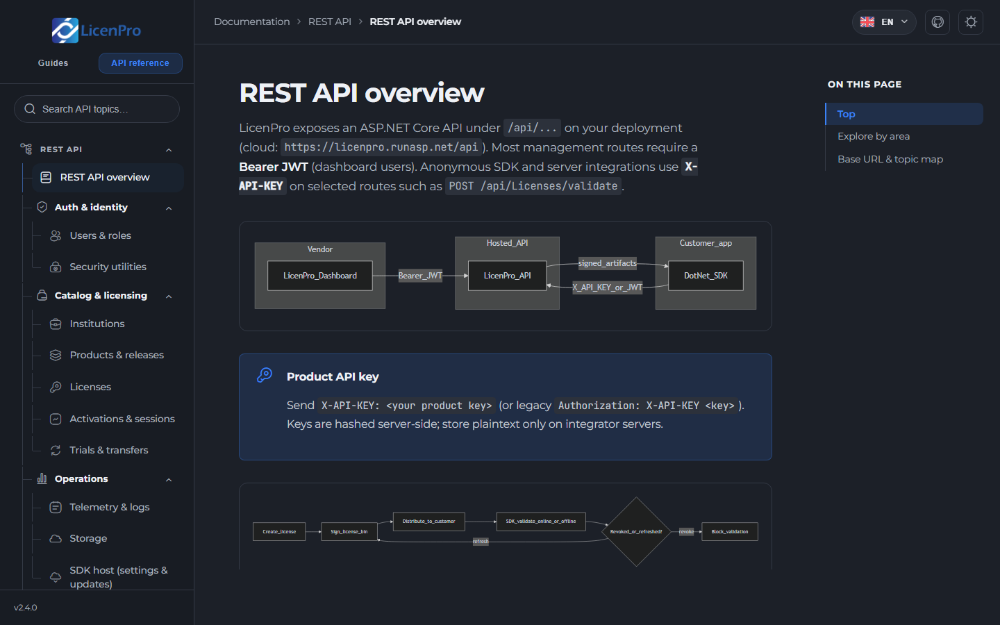

# LicenPro Docs

Public documentation for [LicenPro](https://licenpro.tech) — cryptographically signed licenses, vendor dashboard workflows, REST API, and the .NET SDK.

[](https://docs.licenpro.tech)
[](https://angular.dev)
[](#internationalization)

**Live:** [docs.licenpro.tech](https://docs.licenpro.tech)  
**Source:** [github.com/abdulrahmanMadi/LicenPro-Docs](https://github.com/abdulrahmanMadi/LicenPro-Docs)

<p align="center">
  
</p>

<p align="center"><em>Home hub — Guides tab, search, and jump cards</em></p>

## Screenshots

| Light | Dark |
| --- | --- |
|  |  |

<p align="center">
  
</p>

<p align="center"><em>Quick start — vendor workflow from institution to SDK</em></p>

<p align="center">
  
</p>

<p align="center"><em>REST API overview — system context and license lifecycle diagrams</em></p>

## What this site covers

| Area | Examples |
| --- | --- |
| Get started | Quick start, first institution / product / license, RSA keys |
| Platform | Institutions, products, releases, licenses, activations, sessions, storage, account settings |
| License models | Perpetual, Trial, Subscription, Floating, Concurrent, Node-locked, Credit-Based, Usage-Based |
| .NET SDK | Configuration, LicenseClient, WinForms, WPF, offline / grace, updates |
| REST API | Auth, catalog, licenses, activations, telemetry, billing, admin |
| Operations | Sessions & activations, webhooks, changelog |

## Features

- **Guides + API reference** tabs with a searchable sidebar
- **EN / AR / FR** — locale stored as `licenpro-locale` (shared with the main LicenPro app)
- **RTL** for Arabic, including nav tree, search, and TOC
- **Light / dark** theme (`docs-theme`)
- **Table of contents** built from page headings
- **Mermaid** diagrams on key pages
- **SSR** (Angular 21) for prerendered routes

## Tech stack

- Angular 21 (standalone components, SSR)
- TypeScript
- SCSS + Keenicons
- Mermaid for flow diagrams

## Prerequisites

- Node.js 20+
- npm 10+

## Setup

```bash
git clone https://github.com/abdulrahmanMadi/LicenPro-Docs.git
cd LicenPro-Docs
npm install
npm start
```

Open [http://localhost:4202](http://localhost:4202).

## Scripts

| Command | Description |
| --- | --- |
| `npm start` | Dev server (port **4202**) |
| `npm run build` | Production build (browser + SSR) |
| `npm run watch` | Development build in watch mode |
| `npm run serve:ssr:LicenPro-Docs` | Serve the SSR bundle from `dist/` |

## Internationalization

The language switcher writes `localStorage` key `licenpro-locale` (`en` \| `ar` \| `fr`). Arabic uses **TheYearofHandicrafts** (same family as the LicenPro dashboard); English and French use **Montserrat**.

| Content | Location |
| --- | --- |
| Shell / nav / home strings | `src/app/core/i18n/dictionaries/` |
| Static guide HTML | `src/app/docs/content/static-pages/{en,ar,fr}/` |
| Platform / API / SDK topics | `src/app/docs/content/*.{en,ar,fr}.ts` |
| Changelog entries | `src/app/docs/content/changelog.entries.*.ts` |

Keep brand and tech names in English: LicenPro, SDK, .NET, API, RSA, REST, JWT, WinForms, WPF. In Arabic, Institution is **المؤسسة**.

## Project layout

```
src/app/
  core/i18n/              locale service, pipe, dictionaries
  components/docs-layout/ shell (sidebar, top bar, TOC)
  docs/content/           localized page bodies
  pages/                  routes (home, topics, static docs)
docs/readme/              README screenshots
```

## Related

- Product: [licenpro.tech](https://licenpro.tech)
- Dashboard: [app.licenpro.tech](https://app.licenpro.tech)
- Hosted API: [licenpro.runasp.net/api](https://licenpro.runasp.net/api)
